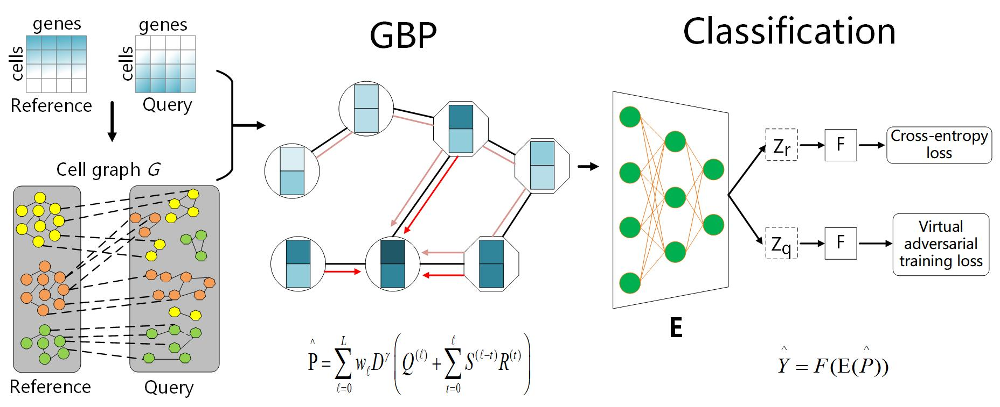

A Robust and Scalable Graph Neural Network for Accurate Single Cell Classification
============


## Overview

Single-cell RNA sequencing (scRNA-seq) techniques provide high-resolution data on cellular heterogeneity in diverse tissues, and a critical step for the data analysis is cell type 
identification. Tradi-tional methods usually cluster the cells and manually identify cell clusters through marker genes, which is time-consuming and subjective. With the launch of 
several large-scale single-cell projects, millions of sequenced cells have been annotated and it is promising to transfer labels from the annotated datasets to newly generated datasets. One powerful way for the transferring is to learn cell relations through the graph neural network (GNN), while vanilla GNN is difficult to process millions of cells due to 
the expensive costs of the message-passing procedure at each training epoch. Here, we have developed a robust and scalable GNN-based meth-od for accurate single cell classification 
(GraphCS), where the graph is constructed to connect similar cells within and between labelled and unlabelled scRNA-seq datasets for propagation of shared information. To overcome 
the slow information propaga-tion of GNN at each training epoch, the diffused information is pre-calculated via the approximate Generalized PageRank algorithm, enabling sublinear
 complexity for a high speed and scalability on millions of cells. Compared with existing methods, GraphCS demonstrates better performance on simulated, cross-platform, and 
cross-species scRNA-seq datasets. More importantly, our model can achieve superior performance on a large dataset with one million cells within 50 minutes.





## Requirements
- CUDA 10.1.243
- python 3.6.10
- pytorch 1.4.0
- GCC 5.4.0
- [cnpy](https://github.com/rogersce/cnpy)
- [swig-4.0.1](https://github.com/swig/swig)
- BBKNN
- Scanpy


## Compilation
```bash
make
```

## Datasets

The `example_data` folder includes example datasets. 


# Run the demo

```
- pre_process raw data: cd data_preprocess; Rscript data_preprocess.R example 
- construct graph: cd graph_construction; python graph.py  --name example
- python -u train.py --data example
```


### or


## Runing the training code directly
```
 if you installed git lfs  and downloaded the processed example data in folder data,
 you can run the following command to train model and predict cell types directly. 
```

```
python -u train.py --data example
```


## output

```
The predicted cell labels will be stored in the dataname_pred.csv. 

```


## Runing your own data

- pre_process raw data: cd data_preprocess; Rscript data_preprocess.R  your_data_name   
- construct graph: cd graph_construction; python graph.py  --name your_data_name
- python -u train.py --data your_data_name 


## Cite
Please cite our paper if you use this code in your own work:

```
@article{zengys,
  title={A Robust and Scalable Graph Neural Networkfor Accurate Single Cell Classification},
  author={Yuansong Zeng, Xiang Zhou, Zixiang Pan, Yutong Lu1, Yuedong Yang},
  journal={xxx},
  year={2021}
}
```

