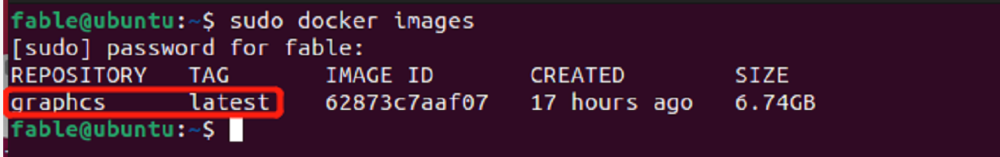
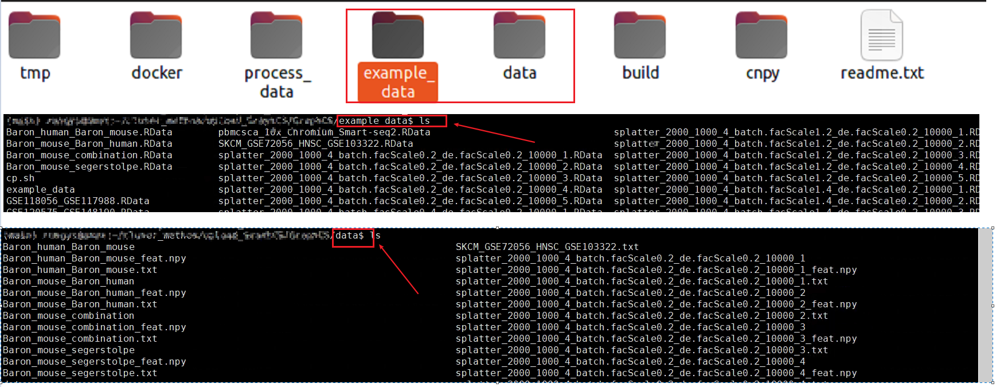
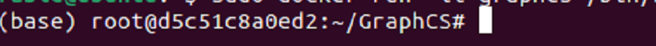
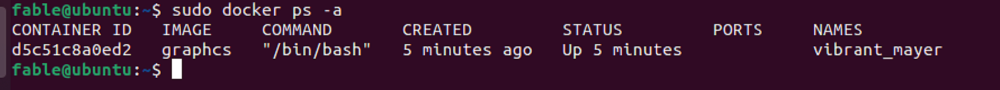

**Note: If you want to run GraphCS with docker version, you need to follow the three steps 
as following instructions:** 

# Setp1: Prepare your host computer

We recommend using **Ubuntu operating system with version 21.04** as same as us (We installed Ubuntu21.04 on a vmware workstation). On the other hand,
  you can also use other versions of the Ubuntu operating system or other operating systems(such as CentOS) as long as 
you can install the Docker and load our graphcs docker image successfully.  

# Setp2: Install Docker and load grahpcs image

## Install Docker

Installing Docker follows the official document: https://docs.docker.com/engine/install/

## Load graphcs image
 Please load the graphcs image after installing Docker successfully as following: 
 
### download

You need to download the graphcs docker image (graphcs.tar.zip) from [website](https://www.synapse.org/#!Synapse:syn26147749/files/)

### Import graphcs image into Docker as following commands: 
1. open a terminal named t1

2. unzip  graphcs.tar.zip

3. `sudo docker load -i graphcs.tar` (load the graphcs docker image)

4. `sudo docker images` (list available docker images in your Docker and graphcs will appear if you load successfully)

5. (Optionally) If the names of REPOSITORY and TAG are "graphcs and latest", please ignore this step. However, 
if the names of REPOSITORY and TAG are none, please follow the following 
command to re-name them (graphcs-image-id can be found in step 4 in this section.):

    `sudo docker tag graphcs-image-id graphcs:latest`
    
Note: if you load graphcs iamge successfully, you will get the following information:

    
    
    
### Run Docker with graphcs image

1. Please download the preprocessed_data (data) and raw_data (example_data) from: [data](https://drive.google.com/drive/folders/1ST0T90HcxCKuxOTmOvqCI-IyE2IY6YvM?usp=sharing)

2. Please Decompress them and organize them as the format of the data folder (folder data and example_data) in [GraphCS](https://github.com/biomed-AI/GraphCS)

The final format of the dataset is organized as follows: there are two folders, the one folder is "data", which contains the preprocessed datasets, 
and the other folder is "example_ data", which contains raw datasets.

3. Run docker with your data path:

- `sudo docker run --shm-size 20g -v absolute-dir-path-to-data:/home/biomed-ai/GraphCS/data
 -v absolute-dir-path-to-example_data:/home/biomed-ai/GraphCS/example_data -it graphcs /bin/bash`

Please replace absolute-dir-path-to-data and absolute-dir-path-to-example_data using the absolute path of data 
and exmaple_data that download from the [website](https://drive.google.com/drive/folders/1ST0T90HcxCKuxOTmOvqCI-IyE2IY6YvM?usp=sharing), respectively.

Note:
- absolute-dir-path-to-data is the absolute path of data that downloaded from [data](https://drive.google.com/drive/folders/1ST0T90HcxCKuxOTmOvqCI-IyE2IY6YvM?usp=sharing),
 for exmaple, '/home/data/'.
- absolute-dir-path-to-example_data is the absolute path of example_data that downloaded from [example_data](https://drive.google.com/drive/folders/1ST0T90HcxCKuxOTmOvqCI-IyE2IY6YvM?usp=sharing),
 for exmaple, '/home/example_data/'.

If you run docker with graphcs image successfully, you will see the following information in terminal t1. 

# step 3: Test datasets with GraphCS
After you load the graphcs image in your Docker successfully following above two steps,
 you can run GraphCS with following three Schemes:

Note: you must execute all commands in terminal t1, which was entering the graphcs running environment. 

##  Scheme I

`python train.py --data Baron_mouse_Baron_human`

or

##  Scheme II

Follow the instructions for running GraphCS in the README.md [reproducibility](https://github.com/biomed-AI/GraphCS/tree/main/reproducibility).

or 

##  Scheme III 
You can run GraphCS with scripts, but firstly you need to copy them into the running docker with
  graphcs image as following 
commands (These scripts are stored in the directory of the same level as the graphcs image):

1. open a new terminal named t2

2. `sudo docker ps -a` to get the CONTAINER_ID  of graphcs docker 
 

3. Running in **terminal t2**:

copy scripts into docker as following:

	`sudo docker cp  run_on_preprocessed_data.sh |  run_all_datasets.sh | run_simulate.sh CONTAINER_ID:/home/biomed-ai/GraphCS/`
	
4. Then, you can run scripts in **terminal t1** using following commands:
	
	`bash    run_on_preprocessed_data.sh | run_all_datasets.sh | run_simulate.sh`
	

